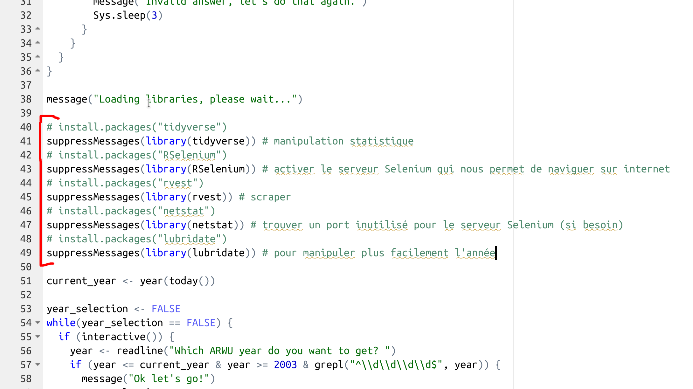

# scrap-arwu

Ce script R permet de *scraper* le classement de Shanghaï (ARWU) pour n'importe quelle année passée, et future lorsque les prochains classements sortiront (si la structure du site ne varie pas trop).

Ce script est destiné à être lancé depuis la *commande line* en utilisant `Rscript`, mais il fonctionne également en mode interactif.

## Installation

### Requirements

**Premièrement**, `scrap-arwu` nécessite que Java soit installé sur l'ordinateur de l'utilisateur. Le programme vérifiera si Java est bien installé à l'exécution en posant directement la question à l'utilisateur. Voir [https://www.java.com/fr/](https://www.java.com/fr/) pour l'installation de Java.

**Deuxièmement**, `scrap-arwu` nécessite les *packages* R suivants : *tidyverse*, *RSelenium*, *rvest*, *netstat* et *lubridate*. Voir le [site du Cran](https://cran.r-project.org/) pour plus d'informations sur ces *packages*.

Pour les installer, ouvrez le script, et dé-commentez les lignes 40, 42, 44, 46 et 48 avant de lancer le code pour la première fois. Une fois que le script aura été lancé pour la première fois avec ces lignes dé-commentées, re-commentez les.



**Troisièmement**, le script nécessite, pour l'instant, le navigateur *Chrome*. Vous pouvez le trouver [ici](https://www.google.com/intl/fr_fr/chrome/).

**Enfin**, le script nécessite R installé sur l'ordinateur de l'utilisateur, cela va de soi.

### Installing *scrap-arwu*

Téléchargez le fichier et mettez-le dans un dossier. Le script créera le fichier `.csv` avec les données scrapées dans ce dossier.

Ouvrez votre terminal de commande, naviguez jusqu'au dossier contenant le script `scrap-arwu` grâce à la commande `cd` et utilisez la commande `Rscript` pour lancer le script, comme ci-dessous.

```
$ cd path/to/script
$ Rscript scrap-arwu.r
```

Le script est exécuté. Il vérifie d'abord si Java est bien installé, puis vous demande quelle année de l'ARWU vous voulez scraper, et enfin vous demander les trois premiers chiffres de votre version de *Chrome* (voir FAQ).

## FAQ

#### Où trouver les trois premiers chiffres de ma version de *Chrome* ?

Les trois premiers chiffres de votre version de *Chrome* permettent au script de choisir la bonne version du *Chrome driver* à utiliser pour naviguer sur internet en utilisant le package *RSelenium*.

Il est possible de les trouver à cette adresse, **depuis votre navigateur *Chrome*** : [chrome://version/](chrome://version/).


## Author

[deroudilhep](https://www.github.com/deroudilhep)

[pierre.deroudilhe@pm.me](mailto:pierre.deroudilhe@pm.me)

## License

[MIT](https://choosealicense.com/licenses/mit/)
